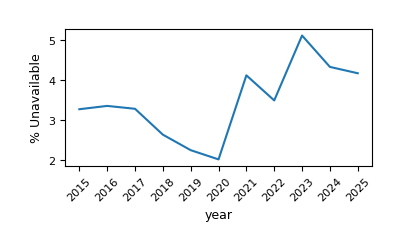
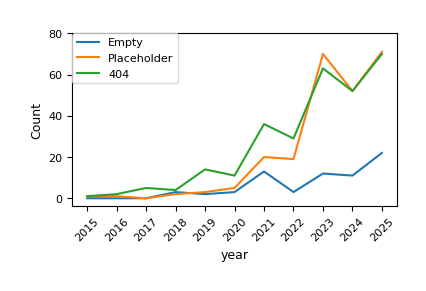

# Papers Without Code

This is the repository for the paper **Papers Without Code: Code and Data Availability Issues in \*CL Publications**. 
In the paper, we analyse the availability of research artifacts linked in *CL publications in the past ten years. Despite increased artifact sharing, the study finds that repository availability has worsened in recent years, largely due to placeholder repositories.

This repository contains code for extracting links to GitHub, HuggingFace and Zenodo from ACL Anthology papers, checking their availability, and generating summary statistics and plots.

<table>
  <tr>
    <td></td>
    <td></td>
  </tr>
</table>

**Note: Since we do not intend to cause any reputational damage to any of the authors associated with the papers in question, we have decided to not share our collected data, but instead making our code available to allow reproduction of the dataset and further analyses of other venues represented in the ACL Anthology. We did not contact any of the researchers to give them a chance to justify code unavailability as part of the project, although we observed in several empty and placeholder repositories that other people had created issues specifically requesting for artefacts to be made available, usually without reaction by the repository owner.**


# Workflow 
The easiest way to reproduce paper statistics and run additional analyses is via `pipeline.py`. This wrapper separates fully automatic processes from those that require manual analysis.
Note that depending on the conference and time period chosen, a very large amount of papers might have to be parsed, so the script may take several hours or days to download all papers, parse relevant links, and check their availability via the GitHub API.

Running the pipeline on Computational Linguistics papers published since 2015 should complete within 1-2 hours and is a good starting point. 

The process for this is described below:

## Setup

Create an environment and install the dependencies:

```bash
python -m venv venv
source venv/bin/activate
pip install -r requirements.txt
```

Copy the contents of dev.env to a .env file and insert the relevant tokens.

Before a fresh run, create the main directories you need:

```bash
mkdir -p extracted_links analysis Plots
```

## Running the Code
Run the automatic components in the pipeline to download CL papers, parse GitHub links, check their availability and generate first summary statistics and plots:
```bash
python pipeline.py auto-run cl --plots
```

For optional LLM-based extraction of GitHub links which did not return available repos in the last step:

```bash
python pipeline.py llm-prepare cl
python pipeline.py llm-run cl
```
This also re-parses any papers that had parsing errors during auto-run. Note that this step requries GPU access. 
An example slurm script is provided in ``llm_extraction.sh``.

To merge llm-based extractions with regex-based extraction rerun `python pipeline.py auto-run cl --plots` 

Among other files used for analysis, the pipeline will write a file named ``deduplicated_papers_with_empty_404_placeholder_repo_cl.csv`` in ``extracted_links/cl/``. This file can be used as a basis for the manual verification of availability. In the paper, we manually checked all Gitub links which returned 404 errors or had less than two files in them to identify error categories. The following categories were identified:

- **404**: Links that return a 404 page and remain unrecoverable after manual
verification;
- **Empty**: Repositories without any files;
- **Placeholder**: Repositories containing only a license or README without
links to code or data or contact information, often limited to the paper title
or a “coming soon” notice.

These categories should be marked in a column named ``manual_check``. Repos that do not fit any of these categories may be left empty. We also checked whether verified unavailable repositories linked to a paper's own artifacts. This may be marked in a column named ``paper_code_or_data``, with possible values ``Yes`` or ``No``. 

To analyze the manually reviewed files and get results and plots about paper unavailabilities run:
```bash 
python pipeline.py manual-analyze cl \
  --conference-name "Computational Linguistics" \
  --manual-review-file extracted_links/cl/deduplicated_papers_with_empty_404_placeholder_repo_cl_manual.csv \
  --plots
```

To parse other events, the following options are currently implemented:

Single event:

```bash
python pipeline.py auto-run {event id based on acl anthology, e.g. acl-2024, naacl-2025}
```

Built-in ACL batch (parses all publications at ACL and collocated events between 2015 and 2025):

```bash
python pipeline.py auto-run acl
```

Built-in CL batch (parses all publications at CL between 2015 and 2025):

```bash
python pipeline.py auto-run cl
```
Other event batches can be easily added by expanding arg_options in ``extract_all_github_repos.py`.
If you want to batch analyze an event over a different timeframe, you can adapt line 294 in ``extract_all_github_repos.py`.


To extract other links run the code below after papers have already been downloaded:

```bash
python extract_other_links_from_anthology.py {event id or acl/cl batch}
python evaluate_other_repositories.py {same event id} {event name, e.g. Computational Lingusitics}
python check_huggingface_links.py {same event id} 
python check_zenodo_links.py {same event id} 
```

The same manual check as above can then be conducted. An additional unavailability category ``incorrect_link`` was introduced here, since many huggingface links seem to point to models which no longer exist under the specified url, but are still available elsewhere on the huggingface hub.

After manual analysis, run the code below to get summary statistics and plots (replace huggingface with zenodo to get results for zenodo links).

```bash
python comparison_of_github_repo_availability.py \
"HF Association for Computational Linguistics" \
"extracted_links/{event id or acl/cl batch}_other_links/huggingface_links_no_duplicates.csv" \
 --unavailable="extracted_links/{event id or acl/cl batch}_other_links/unavailable_huggingface_links_no_duplicates.csv" \
 --get_plots
 ```

